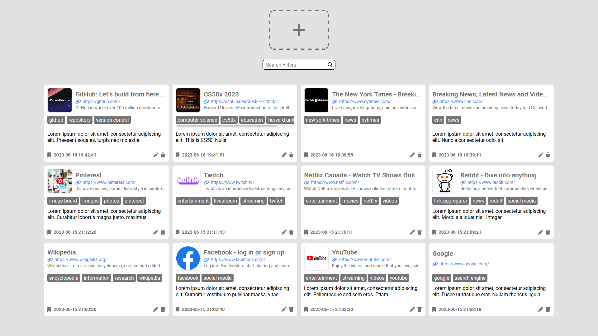
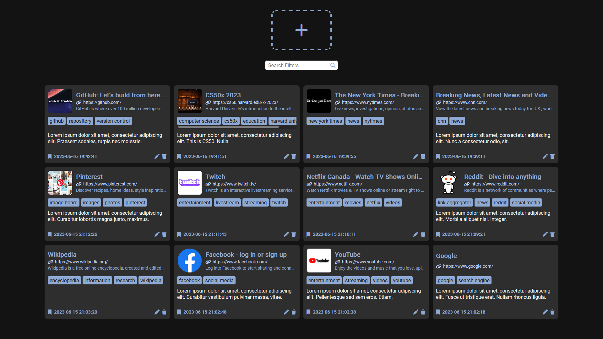

# BookmarksDB

BookmarksDB is a local relational database web application created for easy filtering and quicker lookup of bookmarks by tagging them with related keywords.

## Key Features

- Saving and loading bookmarks from a relational database
- Editing and removing of bookmarks
- Tagging of bookmarks
- Filtering of bookmarks
- Light and dark themes applied automatically using the user's system preferences

## Technologies Used

- **Client**: HTML, CSS, JavaScript
- **Server**: Flask (Python)
- **Database**: SQLite3

## Purpose
BookmarksDB is my final project submission for Harvard University's CS50x: Introduction to Computer Science course. BookmarksDB came about as I struggled to keep my bookmarks organized on my browser's bookmark bar and resorted to storing them in a document along with keywords that I would use to search for. There were many problems with this approach as bookmarks that shared keywords would linearly increase the amount of entries I would have to look through. Although this problem is still present in BookmarksDB, the entries are now centralized and the previews generated by BookmarksDB provides additional ways to query your bookmarks.
## Lessons Learned

There were many challenges I encountered developing BookmarksDB - the most notable challenge being performance and load times. This problem arose when I noticed that scaling the number of bookmarks negatively impacted load times significantly. This was due to the generation of the bookmark previews which is generated through web scraping the metadata of bookmarks. Increasing the number of bookmarks also increased the number of requests the server had to make thus increasing load times. 

My first solution to this problem was to implement concurrency to allow parallel requests to be made instead of waiting for responses before making the next request. This was achieved using the Python library [requests-futures](https://pypi.org/project/requests-futures/) and was significantly faster to load. However, it seemed wasteful to continuously make requests (both for my application and for the requestee) to scrape metadata which is unlikely to be changed often.

My next solution was to cache the requests so future requests could reference the cache instead of making new requests. Using [requests-cache](https://pypi.org/project/requests-cache/) resembled my original code much closer than concurrency and prevented extra calls made to external websites, caching the response into a separate file on the server while maintaining similar increases to load times. I was mostly satisfied with this approach however the amount of data cached was unnecessary as we only need the metadata and not the entire HTML response to be cached.

This lead me to my current solution - store the metadata in the database. With the metadata in the database, there is no need to make any additional requests and the data can be accessed instantly. The size of data stored is also significantly smaller compared to my previous approach as only the necessary data is stored. It's akin to creating my own cache and functionally performs the same as a cache. The biggest consideration I have with this solution was whether to include an expiry date on the cache. On one hand, it will keep the preview updated and changes to the bookmark will be reflected properly. On the other hand, this may not be to the user's benefit as they may have an easier time recognizing the bookmark from past correlations. This is especially true if the website goes down. Thus, I have currently decided to not refresh the cached metadata however this is not set in stone.
## Roadmap

- [Pending] Refreshing of cached bookmark metadata and previews
- Compact view (list instead of cards; no previews)
- Improved web scraping (accessing APIs where possible i.e., Twitter)
- Image and text support (instead of only accepting URLs)

